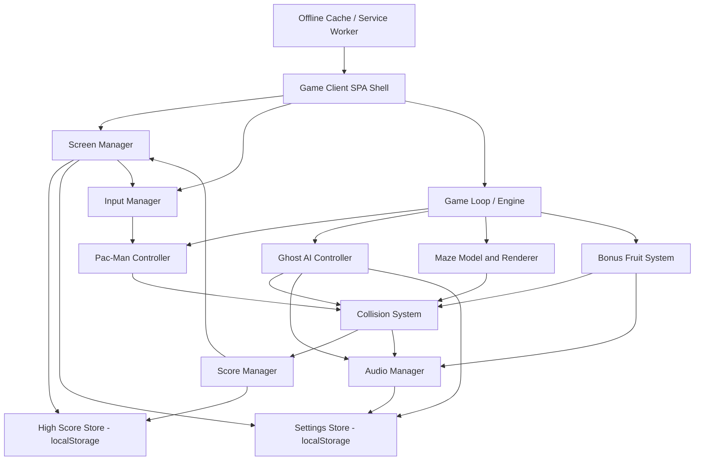

# Architect Mission Report

**Agent**: architect  
**Generated**: 2026-08-16T15:59:39.290Z

---

## Architecture Style

client-only single-page application (offline-capable PWA) with an internal event-driven game engine

## Components

- **Game Client (SPA Shell)** (ui): The HTML/CSS/TypeScript shell that boots the app, mounts the Canvas element and DOM overlay screens, and wires together all in-browser modules.
- **Game Loop / Engine** (service): Fixed-timestep requestAnimationFrame loop that drives update() and render() every frame, coordinating entities, collisions, scoring and level state to guarantee smooth 60fps play.
- **Maze Model & Renderer** (module): Holds the tile grid (walls, corridors, dots, power pellets, tunnel, ghost house), tracks remaining-dot count, and draws the maze plus dots/pellets each frame to Canvas.
- **Pac-Man Controller** (module): Owns Pac-Man's position, current/queued direction, continuous movement-until-wall logic, chomp animation state and tunnel wraparound.
- **Ghost AI Controller** (module): Implements the four distinct personalities (direct chase, ambush-ahead, flank, chase/random hybrid), the chase/scatter timer, frightened (scared) state with reversal/slow-down/flash warning, and eaten-eyes-return-to-house behavior with escalating 200/400/800/1600 scoring.
- **Collision System** (module): Detects tile-level overlaps: Pac-Man vs dot, vs power pellet, vs fruit, vs ghost (normal or scared), and triggers the corresponding state changes and score events.
- **Bonus Fruit System** (module): Spawns the level-specific fruit near the center after ~70 and ~170 dots eaten, times out its disappearance, and awards level-scaled points.
- **Score Manager** (module): Tracks current score, lives, extra-life threshold (10,000 pts), level number/difficulty curve (20+ levels, then repeats hardest settings), and emits events for UI/audio.
- **Input Manager** (module): Normalizes keyboard (arrows/WASD), touch swipe, and on-screen directional buttons into a single directional-intent API; also handles pause/mute key bindings for full keyboard accessibility.
- **Audio Manager** (module): Plays all sound effects and the looping siren via Web Audio API, dynamically adjusts siren playback rate as dots deplete/level increases, and exposes a global mute toggle.
- **Screen Manager** (ui): Manages the DOM overlay state machine: Start, Countdown, Pause, Level Complete, Game Over (with initials entry), rendered as accessible HTML over the Canvas with visible focus indicators.
- **High Score Store** (service): Persists and retrieves the top-10 high score list (initials + score) across sessions.
- **Settings Store** (service): Persists mute state and colorblind-friendly ghost palette preference across sessions.
- **Offline Cache (Service Worker)** (service): Precaches the app shell, code, sprite/audio assets on first load so the game is fully playable offline afterward.

## Tech Stack

- **frontend**: TypeScript + HTML5 Canvas (custom engine, bundled with Vite) — A hand-rolled Canvas engine gives full deterministic control over per-frame movement, collision and ghost-AI timing needed to hit 60fps and match classic arcade feel exactly. React adds DOM-reconciliation overhead irrelevant to a Canvas game loop. Phaser is a full game framework (~1MB+ before any assets) which risks blowing the <2MB budget and hides low-level control the ghost-personality timers need. Plain JS with no build tool would work but loses TypeScript's type safety across many interacting modules (entities, AI, state machines) and Vite's fast dev/HMR + tiny production bundling with PWA plugin support.
- **backend**: None — static, client-only architecture — This is a single-player game with no accounts, no server-authoritative state, and no multiplayer sync — every requirement (high scores, settings) is satisfiable client-side. Adding an Express API or Firebase would introduce hosting cost, latency, and an unnecessary attack surface for zero functional benefit, violating the proportionality principle for a v1 arcade clone.
- **database**: Browser localStorage — Top-10 high scores and a small settings object are tiny, synchronous, key-value data — a perfect fit for localStorage's simple API. IndexedDB is a more powerful async, transactional store meant for larger structured/blob data, which is overkill here. A server-side PostgreSQL DB is irrelevant without a backend and would require auth/network round trips the requirements never call for.
- **auth**: None — no user accounts (3-letter initials entry only) — Requirements only call for entering 3 initials on a high score, not identity or accounts. Introducing OAuth/JWT would add complexity, UI friction, and infra with no requirement driving it.
- **messaging**: In-process event emitter (no external message broker) — All communication (score events, sound triggers, state transitions) happens within a single browser tab/thread. A lightweight internal pub/sub (custom TypeScript EventEmitter) decouples modules like Audio and Score from the Game Loop without needing any real message broker, which would only make sense for distributed, multi-service backends this app doesn't have.
- **audio**: Web Audio API — Web Audio API natively supports precise playback-rate manipulation needed for the siren speeding up as dots deplete, low-latency overlapping SFX (waka-waka + siren + ghost sounds simultaneously), and fine mute control — all with zero extra library weight. HTMLAudioElement lacks reliable low-latency overlapping playback across browsers. Howler.js is a fine wrapper but adds ~20-30KB for abstractions (spatial audio, sprite pooling) this game doesn't need beyond what Web Audio already provides directly.
- **offline/PWA**: Service Worker + Cache API via vite-plugin-pwa (Workbox) — The requirement explicitly demands offline play after first load. vite-plugin-pwa auto-generates a manifest and a battle-tested Workbox service worker integrated into the Vite build, minimizing cache-versioning bugs versus a hand-rolled worker, at a small (~10-20KB) cost that still fits the 2MB budget. Skipping offline support entirely would violate an explicit requirement.
- **infra**: Static hosting + CDN (e.g., Netlify/Vercel static or GitHub Pages) — The build output is pure static assets (HTML/JS/CSS/sprites/audio) with no backend process to run. Static hosting with a CDN gives global low-latency delivery and automatic HTTPS with zero ops overhead. Kubernetes/Docker orchestration is explicitly disproportionate for a static single-player game with no horizontal scaling or multi-service needs.
- **testing**: Vitest (unit) + Playwright (end-to-end, cross-browser) — Vitest shares Vite's config/transform pipeline, giving near-instant unit tests for AI targeting functions, collision logic and score rules without a separate Babel/ts-jest setup. Playwright is chosen over Cypress because it has first-class, officially supported drivers for Chromium, Firefox AND WebKit (Safari) in one API — directly matching the 'all modern browsers' requirement, whereas Cypress's WebKit/Safari support is more limited/experimental.
- **ci-cd**: GitHub Actions — GitHub Actions is native to a GitHub-hosted repo, has a generous free tier, and integrates directly with static-hosting deploy actions (Netlify/Vercel/Pages) with no extra account wiring. GitLab CI and CircleCI are equally capable but require hosting the repo elsewhere or extra external-service configuration for no added benefit here.

## Epics

- **EPIC-001** Maze Rendering & Core Layout: Build the tile-based maze (walls, corridors, dots, 4 power pellets, tunnel wraparound, center ghost house) and render it via Canvas, tracking remaining dot/pellet counts for level-complete detection.
- **EPIC-002** Pac-Man Movement & Input: Implement continuous directional movement that stops only at walls, chomp animation, direction facing, and unify keyboard (arrows/WASD), swipe, and on-screen button input across desktop and mobile.
- **EPIC-003** Ghost AI & Behavior States: Implement the four distinct ghost personalities (direct chase, ambush-ahead, flank, chase/random hybrid), chase/scatter timer alternation, frightened state (reverse, slow, flash warning, eaten-eyes return to ghost house and respawn), and staggered ghost-house release at level/life start.
- **EPIC-004** Collision, Scoring & Lives: Detect Pac-Man collisions with dots/pellets/ghosts/fruit, apply the full point table including escalating 200/400/800/1600 ghost-eat scoring, manage 3 starting lives, death animation/reset, and extra life at 10,000 points.
- **EPIC-005** Bonus Fruit System: Spawn level-appropriate fruit (cherry/strawberry/orange/etc.) near the maze center after ~70 and ~170 dots eaten, award level-scaled points, and auto-expire uncollected fruit.
- **EPIC-006** Level Progression & Difficulty Scaling: Detect level completion (all dots/pellets eaten), advance through 20+ levels with increasing ghost speed, shorter frightened duration, and less scatter time, capping difficulty afterward.
- **EPIC-007** Audio System: Implement all sound effects (dot-eat, pellet, ghost-eat, death, fruit, extra life, startup jingle) and a looping siren whose pitch/speed scales with remaining dots/level, plus a global mute toggle.
- **EPIC-008** Game Flow Screens: Build the Start, Countdown (3-2-1-GO), Pause, Level Complete, and Game Over screens as accessible DOM overlays coordinated with the game state machine.
- **EPIC-009** High Score Persistence: Maintain a top-10 high score list, prompt 3-letter initials entry on a qualifying Game Over, and persist scores across sessions via localStorage.
- **EPIC-010** Accessibility & Colorblind Support: Ensure full keyboard operability of all menus with visible focus indicators, and provide a colorblind-friendly ghost color palette toggle persisted in settings.
- **EPIC-011** Offline Support & Performance Budget: Precache all assets via Service Worker for offline play after first load, keep total assets under 2MB, and sustain smooth 60fps rendering across responsive layouts from 375px to 2560px.

## Architecture Diagram

