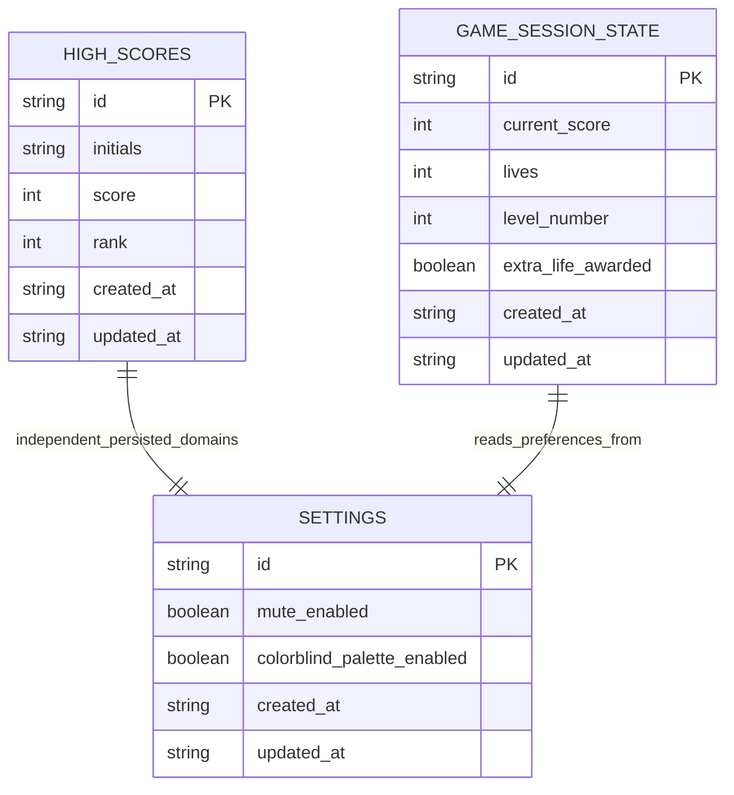

# DBA Mission Report

**Agent**: dba  
**Generated**: 2026-08-16T16:00:22.862Z

---

## Database Engine: Browser localStorage

The architecture and tech stack explicitly specify a client-only, offline-capable SPA with persistence limited to small synchronous key-value data in the browser. localStorage is the required storage engine for top-10 high scores and user settings, matches the no-backend constraint, works offline by default, and avoids introducing any server-side attack surface. Because this is not a relational database engine, the design models persisted records as JSON-serializable collections stored under well-defined localStorage keys.

## Entities (3)

- **high_scores**: 6 columns
- **settings**: 5 columns
- **game_session_state**: 7 columns

## ERD

