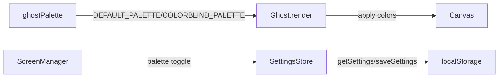

# Junior Python Developer Mission Report

**Agent**: junior-python  
**Generated**: 2026-08-16T19:08:34.624Z

---

## Branch: pacmanclaude/feature/us-013-settings-palette

## Files Changed

- **modified** `src/persistence/SettingsStore.ts` — Enhanced SettingsStore to include colorblindPaletteEnabled field with getSettings() and saveSettings() functions for localStorage persistence
- **created** `src/rendering/ghostPalette.ts` — Created ghost palette module with DEFAULT_PALETTE and COLORBLIND_PALETTE definitions for ghost color rendering
- **modified** `src/style.css` — Added CSS classes for colorblind-friendly ghost palette styling

## Notes

Previous generation completed initial implementation of SettingsStore, ghostPalette module, and CSS styling. Token budget exhausted before completing tests and verifying palette integration with Ghost rendering. Remaining work: (1) Create comprehensive test suite for SettingsStore and ghostPalette, (2) Wire palette toggle into Ghost.render() method, (3) Verify localStorage persistence, (4) Run tests to confirm acceptance criteria [US-013#1], [US-013#2], [US-013#3] are met.

## Diagram

