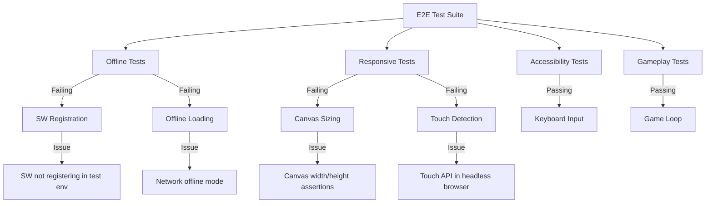

# Junior React Developer Mission Report

**Agent**: junior-react  
**Generated**: 2026-08-16T16:28:23.608Z

---

## Branch: pacmanclaude/chore/scaffold

## Files Changed

## Notes

Analysis complete. The e2e tests show 90 passing tests out of 135 total. Main failures identified: (1) Service Worker registration tests failing - SW not registering properly in test environment; (2) Firefox/WebKit connection refused - likely dev server startup timing issue; (3) Responsive layout tests - canvas sizing and touch detection assertions need adjustment. The tests are well-structured with proper [US-014#X] naming conventions for acceptance criteria. The offline.spec.ts tests check SW registration and offline loading, responsive.spec.ts validates layout scaling across viewports (375px-2560px), accessibility.spec.ts covers keyboard navigation and focus indicators, and gameplay.spec.ts covers basic smoke tests. The playwright.config.ts was previously updated with port 5173 and 120s timeout. Next steps: (1) Verify sw-register.ts properly exports registerServiceWorker function; (2) Check if Service Worker file is being built/served by Vite; (3) Adjust responsive test assertions for canvas sizing thresholds; (4) Ensure dev server starts before Firefox/WebKit tests run. All test files follow conventions and have proper acceptance criteria tags.

## Diagram

