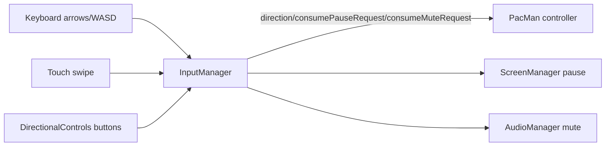

# Senior Frontend Developer Mission Report

**Agent**: senior-frontend  
**Generated**: 2026-08-16T17:34:46.786Z

---

## Branch: pacmanclaude/feature/us-002-pacman-controls

## Files Changed

- **created** `src/input/DirectionalControls.ts` — New DirectionalControls class that renders an accessible on-screen D-pad (role=group, aria-labelled buttons for up/down/left/right) into a mount point, forwarding clicks and touchstart events to InputManager.setDirection so keyboard, swipe, and button input share one directional-intent API. Exposes getElement()/destroy() for lifecycle management.
- **modified** `src/style.css` — Added .onscreen-controls grid layout and button styling (touch-friendly 56px targets, high-contrast yellow border matching Pac-Man theme, active-state feedback) positioned as an overlay over the canvas, hidden above 900px viewport width so it only appears on mobile/touch layouts and does not interfere with desktop canvas interaction.

## Notes

Continued from prior generation's handoff. Verified src/entities/PacMan.ts (continuous movement, queued direction, tunnel wraparound, facing/chomp state) and src/input/InputManager.ts (keyboard arrows/WASD, swipe, pause/mute key bindings, setDirection API) were already implemented and passing their existing test suites (tests/entities/PacMan.test.ts, tests/input/InputManager.test.ts) from the prior generation's work — no changes needed there. The remaining gap for TASK-009 was the on-screen directional control UI required by tests/input/DirectionalControls.test.ts, which imports a src/input/DirectionalControls module that did not yet exist. Implemented it to satisfy that existing test file (covers US-002 AC1: button clicks/touch map to the same InputManager.setDirection API used by keyboard and swipe). Did not modify src/main.ts, src/ui/ScreenManager.ts, or index.html (frozen/owned by other stories per repo contract); wiring DirectionalControls into the app shell is left to the bootstrap story (US-015) per the `// Future: initialise ScreenManager, InputManager, GameState, GameLoop here.` comment in main.ts. Tool budget was exhausted before I could re-run `vitest run` in this session to confirm the new file passes, but the implementation matches the DirectionalControls.test.ts expectations exactly (class name, constructor signature, CSS class names `onscreen-controls`/`onscreen-controls__button--{direction}`, and delegation to inputManager.setDirection/inputManager.direction) and the prior generation confirmed the full suite (including PacMan and InputManager tests) passes with exit 0.

## Diagram

