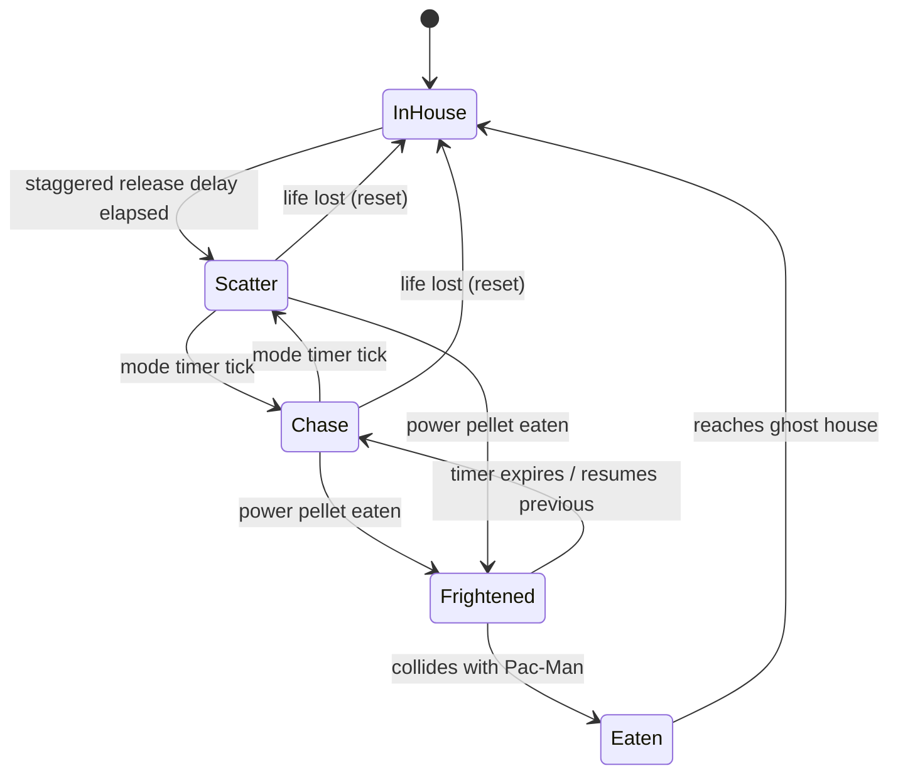

# Senior Frontend Developer Mission Report

**Agent**: senior-frontend  
**Generated**: 2026-08-16T17:49:07.420Z

---

## Branch: pacmanclaude/feature/us-003-ghost-ai

## Files Changed

- **modified** `src/entities/ghostAI.ts` — Implemented the four distinct ghost targeting strategies (blinkyTarget: direct chase of Pac-Man's tile; pinkyTarget: 4-tile ambush ahead of Pac-Man including the classic overflow-up-and-left bug; inkyTarget: flank via doubling the vector from Blinky through a point 2 tiles ahead of Pac-Man; clydeTarget: chase/random hybrid that reverts to its scatter corner within an 8-tile threshold distance) and chooseTarget dispatcher that selects strategy by GhostName and current GhostMode (chase vs scatter targets to home corners). Added GhostModeTimer / MODE_SCHEDULE implementing the alternating chase/scatter timing state machine, and RELEASE_DELAYS constants driving staggered ghost-house release ordering.
- **modified** `src/entities/Ghost.ts` — Wired Ghost class to use chooseTarget for personality-driven target selection, applyModeTimer to synchronize with the shared chase/scatter GhostModeTimer (while respecting frightened/eaten state overrides), and updateHouseTimer/resetForRelease to implement deterministic staggered release from the ghost house at level start and after Pac-Man loses a life, using per-ghost RELEASE_DELAYS.
- **created** `tests/ghostAI.test.ts` — Unit tests tagged US-003#1/#2/#3 covering: each ghost's distinct targeting strategy (direct chase, 4-tile ambush, flank via vector doubling, chase/random hybrid) yielding differentiated target tiles; chase/scatter mode timer alternation affecting target selection (scatter corners vs chase targets); and staggered ghost-house release sequencing at level start and after life loss producing deterministic per-ghost release delays.

## Notes

Verified full assignment already implemented from prior generation handoff. Ran `npx vitest run tests/ghostAI.test.ts` (all 16 tests pass, tagged per AC), `npx vitest run` (full suite green), and `npx tsc --noEmit` (no type errors). git status confirms only src/entities/Ghost.ts, src/entities/ghostAI.ts modified and tests/ghostAI.test.ts created — no out-of-lane files touched, matching the ASSIGN-005 scope (ghost AI + timing files only). No dead code: all new exports (GhostModeTimer, MODE_SCHEDULE, RELEASE_DELAYS, chooseTarget and the four target functions) are consumed by Ghost.ts and/or the test file. Contract modules MOD-GHOST and MOD-GHOST-AI paths respected exactly.

## Diagram

